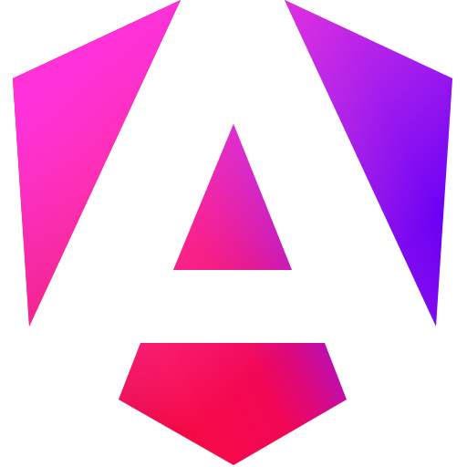

 
  <h1>Hi there, I'm Daniel Torres  </h1>
 

  

## 🙋‍♂️ About me
- 🧑‍💻 I'm a Colombian `Systems and Computer Engineer` (UPTC), class of 2025.
- 🎓 Currently pursuing a postgraduate degree in `Database Specialization` at UPTC.
- 💡 I love software engineering — it’s my lifestyle.
- 🔭 Currently learning `AI` and the `MERN` stack.
- 🤓 I enjoy learning `new technologies` and practicing competitive programming.
- 💪 `Fitness` is another lifestyle I embrace, always striving to improve every day.
- 💼 Open to new `job opportunities`. Contact: **daniel.torres.sw.dev@gmail.com**

## 💻 Tech Stack

 

 

## 📊 GitHub Stats

    
   
   
  &nbsp;
	  
   
   
  <b>Note:</b> Top languages is only a metric of the languages I've working on this public profile, It doesn't show reflect the skill level.

## 🌐 Connect with me

